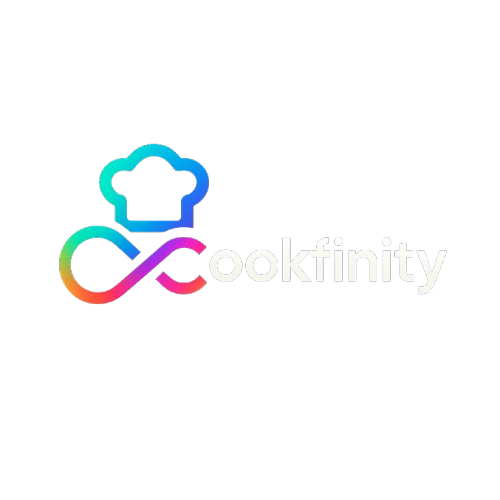

# 🍳 Cookfinity - Interactive Cooking Game

An engaging virtual kitchen experience where you learn to cook real recipes through interactive drag-and-drop gameplay with sound effects and step-by-step guidance.



## ✨ Features

- 🎮 **Interactive Cooking Game** - Drag & drop ingredients to cooking stations
- 🔊 **Sound Effects** - Playful audio feedback for all cooking actions
- ➡️ **Step Navigation** - Manual progression through cooking steps with Next button
- 📱 **Mobile Responsive** - Optimized for all devices
- 🍽️ **Real Recipes** - Powered by Spoonacular API
- 🏆 **Score System** - Points and leaderboard tracking
- 🎨 **Modern UI** - Beautiful gradients and animations

## 🚀 Quick Start

1. **Clone the repository**
   ```bash
   git clone https://github.com/yourusername/cookfinity-cooking-game.git
   cd cookfinity-cooking-game
   ```

2. **Install dependencies**
   ```bash
   npm install
   ```

3. **Set up environment variables**
   ```bash
   cp .env.example .env.local
   # Add your Spoonacular API key to .env.local
   ```

4. **Run the development server**
   ```bash
   npm run dev
   ```

5. **Open [http://localhost:3000](http://localhost:3000)** in your browser

## 🎵 Sound Effects

- **Chopping** (600Hz) - Cutting board actions
- **Frying** (800Hz) - Pan cooking sounds
- **Boiling** (700Hz) - Pot cooking effects
- **Plating** (1200Hz) - Success completion sounds
- **Step Progress** (1000Hz) - Next button feedback

## 🛠️ Tech Stack

- **Framework**: Next.js 15.3.4
- **Language**: TypeScript
- **Styling**: Tailwind CSS
- **Icons**: Lucide React
- **API**: Spoonacular Food API
- **Audio**: Web Audio API

## 📦 Deployment

Ready for deployment on Netlify! See [DEPLOYMENT.md](DEPLOYMENT.md) for detailed instructions.

## 🤝 Contributing

Contributions are welcome! Please feel free to submit a Pull Request.

## 📄 License

This project is open source and available under the [MIT License](LICENSE).
